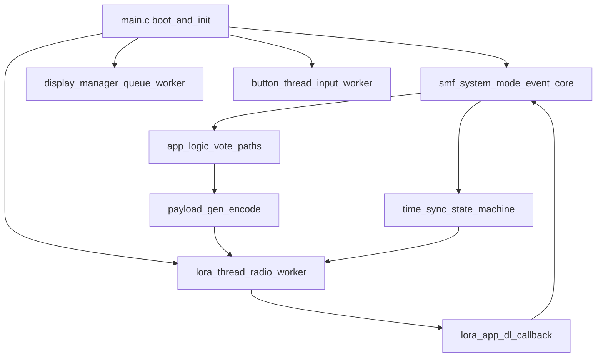

# Class A Firmware Hardening Plan

## Current Architecture (Source-of-Truth Map)
- Boot orchestration is centralized in [`/home/jpandya/Desktop/backup/githubrepo/fb_now/v1.1/app/src/main.c`](/home/jpandya/Desktop/backup/githubrepo/fb_now/v1.1/app/src/main.c), with SMF and worker threads starting after core init.
- Behavior control is state-driven in [`/home/jpandya/Desktop/backup/githubrepo/fb_now/v1.1/app/src/smf_system_mode.c`](/home/jpandya/Desktop/backup/githubrepo/fb_now/v1.1/app/src/smf_system_mode.c), receiving button/LoRa/time events.
- UL transport and LoRa lifecycle are handled in [`/home/jpandya/Desktop/backup/githubrepo/fb_now/v1.1/app/src/lora_thread.c`](/home/jpandya/Desktop/backup/githubrepo/fb_now/v1.1/app/src/lora_thread.c) and [`/home/jpandya/Desktop/backup/githubrepo/fb_now/v1.1/app/src/lora_app.c`](/home/jpandya/Desktop/backup/githubrepo/fb_now/v1.1/app/src/lora_app.c).
- Payload schema and event IDs are defined in [`/home/jpandya/Desktop/backup/githubrepo/fb_now/v1.1/app/include/payload_gen.h`](/home/jpandya/Desktop/backup/githubrepo/fb_now/v1.1/app/include/payload_gen.h) and encoded in [`/home/jpandya/Desktop/backup/githubrepo/fb_now/v1.1/app/src/payload_gen.c`](/home/jpandya/Desktop/backup/githubrepo/fb_now/v1.1/app/src/payload_gen.c).
- Time sync state machine is in [`/home/jpandya/Desktop/backup/githubrepo/fb_now/v1.1/app/src/time_sync.c`](/home/jpandya/Desktop/backup/githubrepo/fb_now/v1.1/app/src/time_sync.c).
- Display and SPI timing constraints are in [`/home/jpandya/Desktop/backup/githubrepo/fb_now/v1.1/app/src/display_manager.c`](/home/jpandya/Desktop/backup/githubrepo/fb_now/v1.1/app/src/display_manager.c).

## High-Risk Findings To Address First
- No system-level hardware watchdog configuration in firmware config path; current timeout protection is local/per-driver only.
- No explicit reset-cause/brown-out telemetry pipeline for postmortem fleet diagnosis.
- Queue-full behavior in SMF/LoRa paths can drop events with log-only handling, reducing reliability under burst/stress.
- SMF directly touches lower-layer queue internals, increasing coupling and making reliability changes harder to isolate.
- Downlink accepted from any FPort and command evolution lacks protocol-version/transaction semantics.

## Reliability Hardening (WDT + Brown-out + Safety)
- Enable Zephyr watchdog path and create a dedicated watchdog service module that:
  - owns WDT init/start/feed,
  - tracks per-thread heartbeat timestamps,
  - resets only when safety policy is violated (not transient delays).
- Add boot-time reset-cause capture (nRF reset-reason register abstraction), persist compact reason + boot counter in retained/persistent store, and clear reason register safely after capture.
- Add brown-out classification to health model (BOR vs SW reset vs WDT reset vs pin reset).
- Add degraded-safe boot behavior for repeated critical boot failures (bounded retry/backoff + minimal mode) to avoid reboot loops.
- Standardize fault severity taxonomy (recoverable, degraded, fatal) and route all fatal paths through a single fault manager.

## UL/DL Evolution (Backward-Compatible)
- Preserve existing event IDs, frame length, and FPort behavior by default.
- Use reserved bytes and/or new optional event IDs on existing housekeeping channel for additive telemetry.
- Add device metadata visibility:
  - fw rev,
  - hw rev,
  - protocol schema rev,
  - boot/reset counters.
- Add DL command `reboot` as distinct from factory reset, with reason code and optional delayed execution.
- Add granular config commands (TLV-style extension family) with transaction ID and ack event to support remote tuning while minimizing retries and power burn.
- Add DL port authorization/validation gate to reduce unintended command execution risk.

## Fleet Health Telemetry Additions
- New/extended health signals:
  - battery health (mV, % estimation quality, low-voltage streak),
  - rolling RSSI/SNR trend summary,
  - reset cause and reset frequency.
- Implement trend compression suitable for Class A budget (windowed min/max/avg or compact deltas).
- Emit health uplinks on event triggers (join complete, reset, threshold crossing) plus sparse periodic cadence.

## Testing & Validation Strategy (Best ROI)
- Current state: build and test process is primarily manual via [`/home/jpandya/Desktop/backup/githubrepo/fb_now/v1.1/app/BUILD.md`](/home/jpandya/Desktop/backup/githubrepo/fb_now/v1.1/app/BUILD.md) and [`/home/jpandya/Desktop/backup/githubrepo/fb_now/v1.1/docs/testing/gateway-test-plan.md`](/home/jpandya/Desktop/backup/githubrepo/fb_now/v1.1/docs/testing/gateway-test-plan.md), with no clear automated firmware regression gate.
- Add staged verification pipeline:
  - P0: CI firmware build gate (`west build`) + static checks,
  - P1: unit tests for payload encoding/decoding, command parsing, time conversion, counter logic,
  - P2: integration tests for SMF transitions/queue pressure/error paths with mocks,
  - P3: scripted HIL smoke suite from existing manual test plan,
  - P4: soak + fault-injection campaign for release qualification.
- Define release gate policy: no firmware merge without passing P0-P2; release branch requires P3 and selected P4 scenarios.

## Refactor Direction (Modular, Concise)
- Extract service boundaries to reduce coupling:
  - `fault_manager`,
  - `watchdog_service`,
  - `lora_service` API facade,
  - `health_telemetry` aggregator.
- Keep SMF focused on orchestration/state; move heavy side-effects and serialization details to dedicated services.
- Replace scattered retry/drop decisions with centralized reliability policy helpers.

## Deliverables (Implementation-ready)
- Design notes for WDT and reset-cause telemetry model.
- UL/DL extension spec with compatibility matrix and migration toggles.
- Test plan uplift from manual-only to CI + integration + HIL gate.
- Incremental PR sequence minimizing backend disruption and field risk.