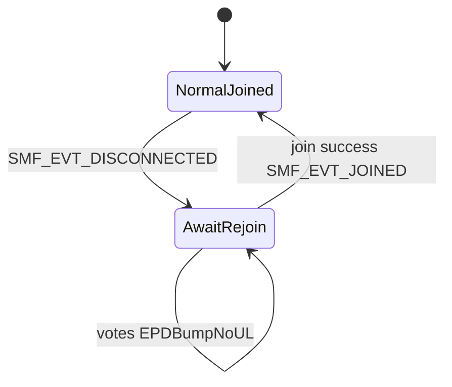

# LoRa join/link review (updated with follow-ups)

## 1. Post-join: what we do, what the patch does, what the MAC probe does

### After `lorawan_join()` returns 0 ([`run_join_cycle`](app/src/lora_thread.c))

1. **`lorawan_set_datarate(LORA_TIME_SYNC_DR)`** — US915: DR3 (SF7/125) so time sync / downlinks are more likely to succeed than DR0.
2. **Optional post-join MAC probe** (`#if LORA_POST_JOIN_MAC_PROBE_RETRIES > 0`): [`lora_mac_probe_after_join()`](app/src/lora_thread.c) loops up to **30** times (500 ms apart), each call **`lorawan_request_link_check(true)`** (force = send empty MCPS frame with LinkCheckReq now, not “append to next app uplink”).
3. **Only if probe returns 0** do we treat join as real: release rails, set `lora_joined_flag`, post `SMF_EVT_JOINED`, etc. If probe never succeeds, we **do not** set joined; we retry OTAA in the same join cycle.

**What we learn from the probe today:** Only a **boolean**: “did `lorawan_request_link_check(true)` return 0 at least once?” That implies the MAC could complete an **MCPS transmit** (empty + LinkCheck) after the join API said success. We **do not** read LinkCheckAns margin or gateway count in application code.

**Can it feed the new link monitor?** Yes, as the **same primitive**: periodic `lorawan_request_link_check(true)` (or `false` to piggyback on next uplink) from the LoRa thread, with success/failure timestamps and error codes—**extend** later if NCS/Zephyr exposes more fields from the confirm path (version-dependent).

### Patch: [`app/patches/zephyr-lorawan-mlme-join-only-sem.patch`](app/patches/zephyr-lorawan-mlme-join-only-sem.patch)

**Problem (without patch):** In Zephyr `subsys/lorawan/lorawan.c`, **`mlme_confirm_handler`** always `k_sem_give(&mlme_confirm_sem)`. **`lorawan_join()`** waits on that semaphore for **any** MLME confirm—not only `MLME_JOIN`. A spurious confirm (e.g. other MLME) can wake join before **JoinAccept** is processed → **`lorawan_join()` returns 0 while not actually joined** (comment in [`sys_config.h`](app/include/sys_config.h) references this).

**Fix:** Only `k_sem_give(&mlme_confirm_sem)` when `mlme_confirm->MlmeRequest == MLME_JOIN`.

**Why probe pairs with patch:** After join API returns, you want proof the MAC can TX; without the patch, “join success” was sometimes false success.

---

## 2. Policy change (agreed): all unconfirmed + better network understanding

- Set **all** `LORA_*_UPLINK_CONFIRMED` to **0** in [`sys_config.h`](app/include/sys_config.h) (NFC, and any others still 1).
- **Remove or narrow** “link lost” logic that counts **confirmed** `-116` chains in [`lora_thread.c`](app/src/lora_thread.c)—with everything unconfirmed, that path becomes irrelevant for health.
- **Replace** with [`lora_link_monitor`](app/src/lora_link_monitor.c) (new): aggregates **`lorawan_send` return codes** (`-ENOTCONN` = session), **probe / LinkCheck** outcomes, optional **DeviceTime** / downlink metrics if available on **NCS v3.0.2** Zephyr pin. **Rejoin** only on policy (e.g. repeated `-ENOTCONN` or probe failure after join), not on spurious ACK loss.

---

## 3. NCS v3.0.2 vs “latest Zephyr main” — patches without editing your global tree

You ship **NCS v3.0.2**; upstream `zephyrproject-rtos/zephyr` main is newer. To avoid hand-editing the installed SDK:

1. **Keep canonical diffs in-repo** under e.g. [`app/patches/`](app/patches/) (already have `zephyr-lorawan-mlme-join-only-sem.patch`). For new upstream fixes, save **`git format-patch`** or **`git diff`** from a clone of the **same base** as NCS’s `sdk-zephyr` commit, or cherry-pick equivalent hunks into one file.
2. **Apply at build time** (recommended):
   - Add a small script `scripts/apply-zephyr-patches.sh` that `cd`s to **`nrf/sdk-zephyr`** (or whatever `west list` shows for Zephyr), runs `git apply --check` then `git apply` for each patch in `app/patches/`, **or** use `git am` if you use mailbox format.
   - Run that script **before** `west build` in CI and document it for local dev.
3. **West / manifest** (optional): NCS can use a **project `userdata` or a wrapper manifest** that points Zephyr to a fork where patches are already merged—heavier operationally.
4. **Version skew note:** a patch copied from **latest main** may not apply cleanly on **NCS’s older Zephyr**; you may need to **rebase the hunk manually** into a patch against your exact `sdk-zephyr` SHA (record SHA in a `PATCHES.md` one-liner if you add docs later).

Do **not** assume GitHub “main” raw file equals your tree line numbers—always regenerate the diff from the NCS-pinned tree or verify with `git apply --check`.

---

## 4. `SMF_EVT_DISCONNECTED` — explicit FSM behavior (your spec)

**Goal:** When the LoRa thread believes the session is lost (clears `lora_joined_flag`, starts backoff), SMF enters a state where:

- **Customer UI:** unchanged (same screens, Staff, votes, EPD thanks/cleaning, etc.).
- **Votes / NFC / counters:** still **increment EEPROM** (and any EPD paths that already run on SMF).
- **LoRa application uplinks:** **do not** build/queue payloads while in this state (simplest: gate at [`lora_put_event`](app/src/lora_app.c) is already `-ENOTCONN` when `!lora_is_joined()`—ensure **callers** don’t treat that as hard error for vote flow, or add `lora_uplink_allowed()` used by SMF/app_logic to skip queue only).
- **Rejoin:** existing **`join_after_backoff_timer` → `LORA_CMD_JOIN_SILENT`** unchanged; on success, exit disconnected state and resume uplinks.
- **Reboot:** existing post-boot **counter sync** (and join if needed) already reconciles counters to the network—no change to that story.

**Implementation sketch:**

- Add **`MODE_AWAIT_REJOIN`** (or a **`network_uplink_suspended`** flag in `MODE_NORMAL`—pick one to avoid duplicating Staff/NFC logic). On `SMF_EVT_DISCONNECTED`, transition into it from `MODE_NORMAL` (and define interaction if Staff/NFC active—likely **only** arm when returning to Normal, or set flag regardless and let uplink gate handle it).
- **`app_logic` / NFC paths:** on vote success, always **`button_counter_store` / EEPROM**; call **`lora_put_event`** only if `lora_is_joined()` (or new `lora_may_queue_uplink()` that is false in await-rejoin). If `lora_put_event` returns `-ENOTCONN`, **do not** treat as fatal—log DBG, UI already updated.
- **Optional:** tiny EPD or LED hint for “reconnecting” only if product wants it later (you said no UI change for now).

**Important:** Today **`lora_put_event` already returns `-ENOTCONN`** when not joined—votes may already be dropping **uplink** while counters might still increment depending on [`app_logic.c`](app/src/app_logic.c) order. Code review during implementation must confirm **counter increment happens before or regardless of** `lora_put_event` failure.

---

## 5. Architecture diagram (updated)



---

## 6. References (upstream vs your tree)

- [Zephyr LoRaWAN subsystem (main)](https://github.com/zephyrproject-rtos/zephyr/tree/main/subsys/lorawan)
- [Zephyr lorawan include (main)](https://github.com/zephyrproject-rtos/zephyr/blob/main/include/zephyr/lorawan/)
- **Implement against:** Zephyr revision inside **NCS v3.0.2** `sdk-zephyr`, not main.

---

## 7. Resolved / superseded from earlier plan

- “Ask Zephyr version” → **NCS v3.0.2** (pin `sdk-zephyr` for API audit).
- `SMF_EVT_DISCONNECTED` → **handled** as explicit await-rejoin behavior above, not removed.

---

## 8. NCS v3.0.2 (`/home/jpandya/ncs/v3.0.2/zephyr/subsys/lorawan`) — what we can use (verified)

Public API: `~/ncs/v3.0.2/zephyr/include/zephyr/lorawan/lorawan.h`. Implementation: `~/ncs/v3.0.2/zephyr/subsys/lorawan/lorawan.c`.

### 8.1 LinkCheck answer callback (best signal for “RF / gateway hears us” without confirmed app payloads)

```c
typedef void (*lorawan_link_check_ans_cb_t)(uint8_t demod_margin, uint8_t nb_gateways);
void lorawan_register_link_check_ans_callback(lorawan_link_check_ans_cb_t cb);
int lorawan_request_link_check(bool force_request);
```

- **`lorawan_request_link_check(true)`** queues `MLME_LINK_CHECK`, then sends an **empty unconfirmed** frame (`lorawan_send(0, "", 0, UNCONFIRMED)`) so the request goes out immediately (same pattern as firmware **post-join MAC probe**; **not** called from daily HK anymore—**6 h** cadence via link monitor / LoRa thread).
- On **`MLME_LINK_CHECK`** success, **`mlme_confirm_handler`** calls `link_check_cb(DemodMargin, NbGateways)` from LoRaMac confirm data (see `lorawan.c` `mlme_confirm_handler` `case MLME_LINK_CHECK`).
- **Link monitor use:** register once from **LoRa thread** after stack is up; in the callback **only** record atomics (margin, gw count, uptime of last answer) or **`k_work_submit`** — do **not** call `lorawan_send` / `lorawan_join` from inside the callback (ISR/MAC context).
- **Heuristics:** e.g. `nb_gateways == 0` or margin below a threshold for **K** consecutive answers → classify **WEAK_LINK** (advisory); do **not** clear session on that alone.

### 8.2 `lorawan_send` return path (session / duty-cycle / TX failure)

- `lorawan_send` waits on **`mcps_confirm_sem`**; non-OK → `lorawan_eventinfo2errno(last_mcps_confirm_status)` (e.g. timeout paths for confirmed uplinks).
- **`-ENOTCONN`** still comes from errno mapping when MAC rejects TX (firmware already treats as session lost).
- With **all unconfirmed** app traffic, use this mainly for **`-ENOTCONN`** and rare **`-EAGAIN`** / busy — not for ACK-timeout chains.

### 8.3 `lorawan_register_dr_changed_callback`

- Notifies when **ADR** or stack moves datarate (`datarate_observe` in `lorawan.c`). Useful to **log** link adaptation; optional input to “weak link” if DR drops to min repeatedly.

### 8.4 Device time (already in firmware)

- `lorawan_request_device_time` / `lorawan_device_time_get` — good **downlink + MAC command path** health check when you run time sync; failure modes already partially surfaced via `time_sync.c`.

### 8.5 Stock NCS bug your patch fixes (still present in vanilla `lorawan.c`)

- **`mlme_confirm_handler`** ends with **unconditional** `k_sem_give(&mlme_confirm_sem)` (line ~227). Any MLME confirm can unblock **`lorawan_join()`**’s `k_sem_take` — same race your [`zephyr-lorawan-mlme-join-only-sem.patch`](app/patches/zephyr-lorawan-mlme-join-only-sem.patch) fixes. **Keep applying that patch** on NCS v3.0.2 unless Nordic ships an equivalent fix in your exact tag.

---

## 9. Link monitor — methodology (what it does, where it runs)

| Layer | Responsibility |
|--------|----------------|
| **Inputs** | (1) `lorawan_send` ret from `lora_send_helper` / msg loop: success timestamp, `-ENOTCONN` count. (2) LinkCheckAns callback: margin + nb_gateways + timestamp. (3) Optional: DR-changed cb, DeviceTime success/fail from existing time_sync hooks. |
| **State** | Small enum or flags: `OK`, `WEAK` (RF marginal), `SESSION_LOST` (stack says not connected). Only **SESSION_LOST** drives clearing `lora_joined_flag` + backoff + `SMF_EVT_DISCONNECTED` (per product policy). |
| **Where it runs** | **Registration** and **periodic tick** from **LoRa thread** only (`lorawan_register_*` + `lorawan_request_link_check` already called there for commands). Callback → atomics + optional `k_work` to SMF only if UI needs it later. |
| **When to tick** | **Not** from housekeeping (LinkCheck removed from HK). **Every 6 hours** from LoRa thread only: e.g. `k_timer` + `k_work` that `lora_cmd_put(LORA_CMD_LINK_CHECK_FORCE)` or call `lorawan_request_link_check(true)` inside LoRa thread after dequeue (same as today’s cmd handler). |
| **What it does *not* do** | Replace NS metrics; it only **characterizes device-side MAC visibility**. Rejoin policy stays conservative: **ENOTCONN**-driven session loss + optional “probe failed N times after join” — not single margin blip. |

---

## 10. Locked product defaults (implementation checklist)

Paths in this repo use [`app/app/include/sys_config.h`](app/app/include/sys_config.h) and [`app/app/src/housekeeping.c`](app/app/src/housekeeping.c) (nested `app/app` tree).

### 10.1 All application uplinks unconfirmed

- Set **`LORA_NFC_UPLINK_CONFIRMED`** to **`0`** (today `1`); keep **`LORA_BUTTON`**, **`LORA_HEARTBEAT`**, **`LORA_COUNTER_SYNC`** at **`0`**.
- In **`lora_thread.c`**: remove or simplify **`consecutive_send_failures`** path that only applied to **confirmed** failures (no longer needed for NFC/HK once all unconfirmed).

### 10.2 Remove LinkCheck from heartbeat / housekeeping

- In **`housekeeping_run()`**: **delete** **`lora_request_link_check(true);`** (and any comment tying HK to LinkCheck). Daily HK remains: battery (if ADC ok), time sync request, counter sync, HK snapshot, rails — **no** MAC LinkCheck on that path.

### 10.3 LinkCheck every **6 hours** (not on HK)

- Add **`#define LORA_LINK_CHECK_INTERVAL_HOURS 6`** (or seconds constant) in **`sys_config.h`**.
- **LoRa thread only:** `k_timer` firing every 6 h (only while joined—start after join success, stop on disconnect if desired), expiry submits **`k_work`** that queues **`LORA_CMD_LINK_CHECK`** / existing handler path so **`lorawan_request_link_check(true)`** runs without blocking ISR. Alternatively extend **`lora_app.h`** with **`LORA_CMD_LINK_CHECK_SCHEDULED`** if cleaner than reusing FORCE.
- **Post-join MAC probe** unchanged: still validates MAC immediately after join (independent of 6 h timer).

### 10.4 Rejoin backoff **3 hours**

- Set **`LORA_JOIN_BACKOFF_HOURS`** from **`6`** to **`3`** in **`sys_config.h`**; update comment block that mentions “prod = 6–24” if you keep docs in sync.

### 10.5 Order of implementation (suggested)

1. `sys_config.h` (confirmed flags, backoff 3 h, new 6 h define).  
2. Remove HK LinkCheck line.  
3. Add 6 h timer + work + LoRa cmd path (or inline in thread loop with last-check timestamp).  
4. Strip confirmed-failure “link lost” counter logic if redundant.  
5. Later: `lorawan_register_link_check_ans_callback` + link monitor state machine + SMF await-rejoin (rest of plan).
