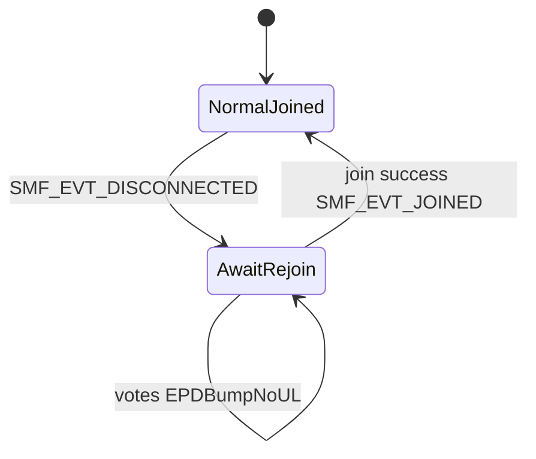

# LoRa join/link review (updated with follow-ups)

## 1. Post-join: what we do, what the patch does, what the MAC probe does

### After `lorawan_join()` returns 0 ([`run_join_cycle`](app/src/lora_thread.c))

1. **`lorawan_set_datarate(LORA_TIME_SYNC_DR)`** — US915: DR3 (SF7/125) so time sync / downlinks are more likely to succeed than DR0.
2. **Optional post-join MAC probe** (`#if LORA_POST_JOIN_MAC_PROBE_RETRIES > 0`): [`lora_mac_probe_after_join()`](app/src/lora_thread.c) loops up to **30** times (500 ms apart), each call **`lorawan_request_link_check(true)`** (force = send empty MCPS frame with LinkCheckReq now, not “append to next app uplink”).
3. **Only if probe returns 0** do we treat join as real: release rails, set `lora_joined_flag`, post `SMF_EVT_JOINED`, etc. If probe never succeeds, we **do not** set joined; we retry OTAA in the same join cycle.

**What we learn from the probe today:** Only a **boolean**: “did `lorawan_request_link_check(true)` return 0 at least once?” That implies the MAC could complete an **MCPS transmit** (empty + LinkCheck) after the join API said success. We **do not** read LinkCheckAns margin or gateway count in application code.

**Can it feed the new link monitor?** Yes, as the **same primitive**: periodic `lorawan_request_link_check(true)` (or `false` to piggyback on next uplink) from the LoRa thread, with success/failure timestamps and error codes—**extend** later if NCS/Zephyr exposes more fields from the confirm path (version-dependent).

### Patch: [`app/patches/zephyr-lorawan-mlme-join-only-sem.patch`](app/patches/zephyr-lorawan-mlme-join-only-sem.patch)

**Problem (without patch):** In Zephyr `subsys/lorawan/lorawan.c`, **`mlme_confirm_handler`** always `k_sem_give(&mlme_confirm_sem)`. **`lorawan_join()`** waits on that semaphore for **any** MLME confirm—not only `MLME_JOIN`. A spurious confirm (e.g. other MLME) can wake join before **JoinAccept** is processed → **`lorawan_join()` returns 0 while not actually joined** (comment in [`sys_config.h`](app/include/sys_config.h) references this).

**Fix:** Only `k_sem_give(&mlme_confirm_sem)` when `mlme_confirm->MlmeRequest == MLME_JOIN`.

**Why probe pairs with patch:** After join API returns, you want proof the MAC can TX; without the patch, “join success” was sometimes false success.

---

## 2. Policy change (agreed): all unconfirmed + better network understanding

- Set **all** `LORA_*_UPLINK_CONFIRMED` to **0** in [`sys_config.h`](app/include/sys_config.h) (NFC, and any others still 1).
- **Remove or narrow** “link lost” logic that counts **confirmed** `-116` chains in [`lora_thread.c`](app/src/lora_thread.c)—with everything unconfirmed, that path becomes irrelevant for health.
- **Replace** with [`lora_link_monitor`](app/src/lora_link_monitor.c) (new): aggregates **`lorawan_send` return codes** (`-ENOTCONN` = session), **probe / LinkCheck** outcomes, optional **DeviceTime** / downlink metrics if available on **NCS v3.0.2** Zephyr pin. **Rejoin** only on policy (e.g. repeated `-ENOTCONN` or probe failure after join), not on spurious ACK loss.

---

## 3. NCS v3.0.2 vs “latest Zephyr main” — patches without editing your global tree

You ship **NCS v3.0.2**; upstream `zephyrproject-rtos/zephyr` main is newer. To avoid hand-editing the installed SDK:

1. **Keep canonical diffs in-repo** under e.g. [`app/patches/`](app/patches/) (already have `zephyr-lorawan-mlme-join-only-sem.patch`). For new upstream fixes, save **`git format-patch`** or **`git diff`** from a clone of the **same base** as NCS’s `sdk-zephyr` commit, or cherry-pick equivalent hunks into one file.
2. **Apply at build time** (recommended):
   - Add a small script `scripts/apply-zephyr-patches.sh` that `cd`s to **`nrf/sdk-zephyr`** (or whatever `west list` shows for Zephyr), runs `git apply --check` then `git apply` for each patch in `app/patches/`, **or** use `git am` if you use mailbox format.
   - Run that script **before** `west build` in CI and document it for local dev.
3. **West / manifest** (optional): NCS can use a **project `userdata` or a wrapper manifest** that points Zephyr to a fork where patches are already merged—heavier operationally.
4. **Version skew note:** a patch copied from **latest main** may not apply cleanly on **NCS’s older Zephyr**; you may need to **rebase the hunk manually** into a patch against your exact `sdk-zephyr` SHA (record SHA in a `PATCHES.md` one-liner if you add docs later).

Do **not** assume GitHub “main” raw file equals your tree line numbers—always regenerate the diff from the NCS-pinned tree or verify with `git apply --check`.

---

## 4. `SMF_EVT_DISCONNECTED` — explicit FSM behavior (your spec)

**Goal:** When the LoRa thread believes the session is lost (clears `lora_joined_flag`, starts backoff), SMF enters a state where:

- **Customer UI:** unchanged (same screens, Staff, votes, EPD thanks/cleaning, etc.).
- **Votes / NFC / counters:** still **increment EEPROM** (and any EPD paths that already run on SMF).
- **LoRa application uplinks:** **do not** build/queue payloads while in this state (simplest: gate at [`lora_put_event`](app/src/lora_app.c) is already `-ENOTCONN` when `!lora_is_joined()`—ensure **callers** don’t treat that as hard error for vote flow, or add `lora_uplink_allowed()` used by SMF/app_logic to skip queue only).
- **Rejoin:** existing **`join_after_backoff_timer` → `LORA_CMD_JOIN_SILENT`** unchanged; on success, exit disconnected state and resume uplinks.
- **Reboot:** existing post-boot **counter sync** (and join if needed) already reconciles counters to the network—no change to that story.

**Implementation sketch:**

- Add **`MODE_AWAIT_REJOIN`** (or a **`network_uplink_suspended`** flag in `MODE_NORMAL`—pick one to avoid duplicating Staff/NFC logic). On `SMF_EVT_DISCONNECTED`, transition into it from `MODE_NORMAL` (and define interaction if Staff/NFC active—likely **only** arm when returning to Normal, or set flag regardless and let uplink gate handle it).
- **`app_logic` / NFC paths:** on vote success, always **`button_counter_store` / EEPROM**; call **`lora_put_event`** only if `lora_is_joined()` (or new `lora_may_queue_uplink()` that is false in await-rejoin). If `lora_put_event` returns `-ENOTCONN`, **do not** treat as fatal—log DBG, UI already updated.
- **Optional:** tiny EPD or LED hint for “reconnecting” only if product wants it later (you said no UI change for now).

**Important:** Today **`lora_put_event` already returns `-ENOTCONN`** when not joined—votes may already be dropping **uplink** while counters might still increment depending on [`app_logic.c`](app/src/app_logic.c) order. Code review during implementation must confirm **counter increment happens before or regardless of** `lora_put_event` failure.

---

## 5. Architecture diagram (updated)

---

## 6. References (upstream vs your tree)

- [Zephyr LoRaWAN subsystem (main)](https://github.com/zephyrproject-rtos/zephyr/tree/main/subsys/lorawan)
- [Zephyr lorawan include (main)](https://github.com/zephyrproject-rtos/zephyr/blob/main/include/zephyr/lorawan/)
- **Implement against:** Zephyr revision inside **NCS v3.0.2** `sdk-zephyr`, not main.

---

## 7. Resolved / superseded from earlier plan

- “Ask Zephyr version” → **NCS v3.0.2** (pin `sdk-zephyr` for API audit).
- `SMF_EVT_DISCONNECTED` → **handled** as explicit await-rejoin behavior above, not removed.
