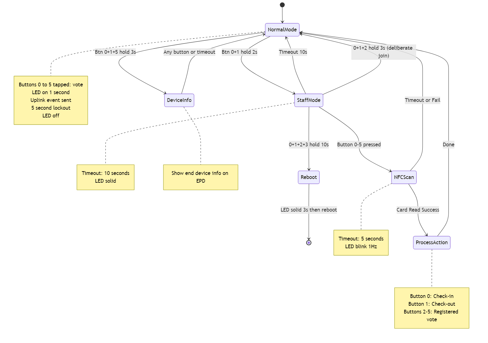
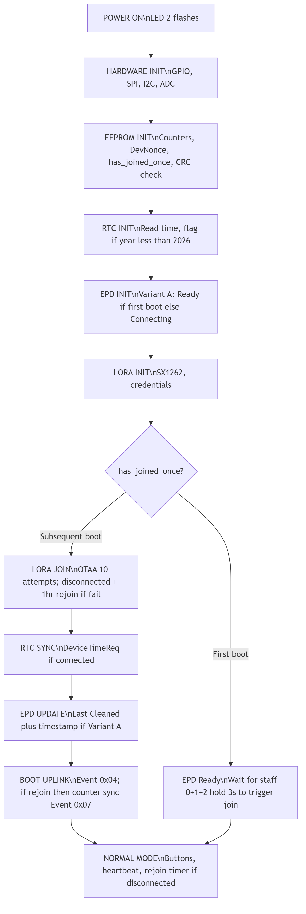
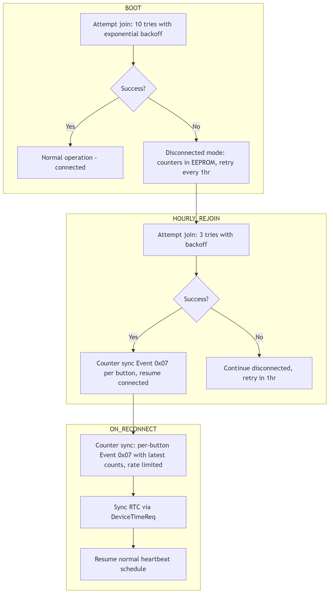
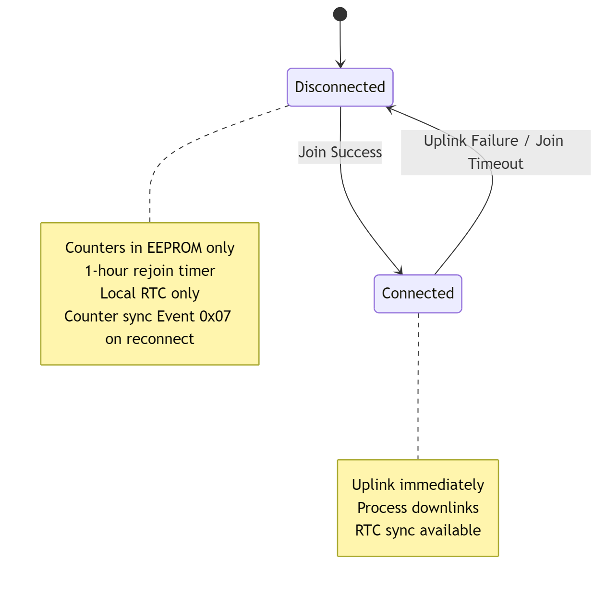

\thispagestyle{empty}  <!-- Removes page number on front page -->
\newpage  <!-- Forces new page for content -->

## 1. Overview

FlexBox v1.1 is a battery-operated LoRaWAN feedback device designed for indoor deployment (e.g., bathrooms, retail spaces, airports). The device captures user sentiment via 6 physical buttons and supports employee check-in/check-out workflows via NFC. An optional e-paper display shows timestamps and status. All data is uplinked (device → network) to a LoRaWAN network for backend processing; downlinks (network → device) deliver commands and configuration.

**System Concept:**

The device serves two user types: (1) **Public users** (customers, visitors) who press a single button to submit feedback, and (2) **Staff** (custodians, managers) who use NFC cards to check-in, check-out, or log issues. Each interaction generates an uplink message containing a timestamp, event type, and relevant data (button ID, counter, or User ID). The backend receives this raw data and applies business logic (session tracking, analytics, alerts). The device itself is stateless, it captures and transmits data without interpreting meaning.

**Hardware Components:**

| Component | Description |
|-----------|-------------|
| MCU | NRF52840 |
| Buttons | 6 physical buttons (0-5) |
| NFC | PN5180 module, ISO15693 protocol |
| LoRa | SX1262 module |
| Display | E-Paper / EPD (optional, Variant A only) |
| Timekeeping | External RTC (Real-Time Clock, maintains time when powered off) |
| Storage | EEPROM (non-volatile memory) + SDHC card slot |
| Feedback | 1 LED |
| Power | Replaceable battery (9600mAh), ADC monitoring |
| Unused | Reed switch (reserved for future) |

> **Note:** Values marked with an asterisk (*) throughout this document are configurable and subject to customer sign-off.

---

## 2. User Roles & Interactions

### 2.1 User Types

| User Type | Description | Authentication |
|-----------|-------------|----------------|
| **Public** | General foot traffic (customers, visitors) | None |
| **Staff** | Custodians, managers, employees | NFC card (ISO15693, 4-byte User ID) |

### 2.2 Button Layout

| Button | Color | Public Mode | Staff Mode |
|--------|-------|-------------|------------|
| 0 | Green | Positive feedback (Happy) | Check-in |
| 1 | Yellow | Neutral feedback (Satisfied) | Check-out |
| 2 | Red | Issue (per decal) | Registered Vote |
| 3 | Red | Issue (per decal) | Registered Vote |
| 4 | Red | Issue (per decal) | Registered Vote |
| 5 | Red | Issue (per decal) | Registered Vote |

---

## 3. System States & Transitions

### 3.1 Button Combinations

| Combo | Hold Duration | Action |
|-------|---------------|--------|
| Single button (0-5) | Tap | Public feedback vote |
| Button 0+1 | 2 seconds* | Enter Staff Mode |
| Button 0+1+5 | 3 seconds* | Device Info display |
| All 6 buttons | 10 seconds* | Reboot device |

### 3.2 State Machine

### 3.3 System Modes & States

| State | Entry Trigger | Timeout | On Timeout | LED |
|-------|---------------|---------|------------|-----|
| Normal | Boot complete / other states exit | None | - | Off |
| Staff Mode | Button 0+1 hold 2s* | 10s* | Return to Normal | Solid on |
| NFC Scan | Button press in Staff Mode | 5s* | Return to Normal | Blink 1Hz |
| Device Info | Button 0+1+5 hold 3s* | 30s* | Return to Normal | - |
| Reboot | All 6 buttons hold 10s* | - | - | Solid 3s |

### 3.4 Timeout Summary

| Context | Timeout | Behavior |
|---------|---------|----------|
| Staff Mode waiting | 10 seconds* | Return to Normal (no uplink) |
| NFC Scan waiting | 5 seconds* | Return to Normal (no uplink) |
| Device Info display | 30 seconds* | Return to Normal |
| Public button lockout | 5 seconds* | Accept next press |
| EPD "Thanks for your Feedback!" | 5 seconds* | Return to "Last Cleaned" |

### 3.5 Interaction Summary

| Action | User | Trigger | Result |
|--------|------|---------|--------|
| Feedback Vote | Public | Single button press | LED confirmation, LoRa uplink |
| Check-in | Staff | Staff Mode → Button 0 → NFC tap | EPD: "Cleaning in progress", NFC uplink per schema |
| Check-out | Staff | Staff Mode → Button 1 → NFC tap | EPD: "Last Cleaned" + timestamp, NFC uplink per schema  |
| Registered Vote | Staff | Staff Mode → Button 2-5 → NFC tap | Uplink with button ID + NFC uplink per schema |

---

## 4. Functional Requirements

### 4.1 Button Behavior

**Public Mode (Normal):**

- Single button tap triggers feedback vote
- LED solid for 1 second* confirms acceptance
- 5-second* lockout prevents spam (silent rejection, no LED)
- Uplink Event 0x00 with button ID and running counter

**Staff Mode:**

- Button press in Staff Mode selects action type and starts NFC scan
- No lockout between actions (staff may need multiple votes)

**Button Counters:**

- Each button maintains independent running counter (24-bit, max 16,777,216)
- Counters persist across power cycles (stored in EEPROM)
- Counters persist across battery replacement

**Offline Operation:**

- Button presses accepted regardless of network connection state
- When offline: Events queued in EEPROM for later transmission
- LED and EPD feedback operate normally (user sees no difference)
- Queued events transmitted automatically when network reconnects

### 4.2 NFC / Staff Mode

**Staff Mode Entry:**

- Button 0+1 held for 2 seconds*
- LED turns solid to indicate active state
- 10-second* timeout to select action

**NFC Scan Flow:**

1. Staff presses button (0-5) in Staff Mode
2. LED blinks 1Hz (waiting for card)
3. Staff taps ISO15693 card within 5 seconds*
4. Device reads 4-byte User ID from designated memory block
5. Action executes based on button pressed

**Actions:**

| Button | Action | Event Type | EPD Update |
|--------|--------|------------|------------|
| 0 | Check-in | 0x01 | "Cleaning in progress" |
| 1 | Check-out | 0x02 | "Last Cleaned" + timestamp |
| 2-5 | Registered Vote | 0x03 | No change |

**NFC Failure:**

- Read timeout or error: LED 3 fast blinks, return to Normal

### 4.3 E-Paper Display (Variant A Only)

**Display States:**

| State | Content | Trigger |
|-------|---------|---------|
| Default | "Last Cleaned" (heading) + "yyyy/mm/dd hh:mm" (timestamp) | Boot, Check-out |
| Feedback Ack | "Thanks for your Feedback!" | Public button press |
| Cleaning | "Cleaning in progress" | Check-in |
| Device Info | DevEUI, FW version, battery %, counters | Button 0+1+5 hold |
| Boot | "Connecting..." | During LoRa join |

{ width=50% }
{ width=50% }

**Timing:**

- "Thanks for your Feedback!" displays for 5 seconds*, then returns to default
- "Cleaning in progress" persists until check-out

**Downlink EPD Updates:**

- Backend can push "Last Cleaned" timestamp via downlink
- EPD downlink updates only processed after heartbeat (not after public button press to avoid UX confusion)

### 4.4 LED Feedback

| State | LED Pattern | Duration |
|-------|-------------|----------|
| Power On | 2 quick flashes | ~200ms |
| Join Success | 3 quick flashes | ~300ms |
| Normal / Idle | Off | - |
| Button Accepted (public) | Solid on | 1 second |
| Button Rejected (lockout) | Off | - |
| Staff Mode Active | Solid on | Until exit |
| NFC Waiting | Blink 1Hz | Until scan/timeout |
| NFC Read Fail | 3 fast blinks | ~600ms |
| Check-in Confirmed | Solid on | 2 seconds |
| Check-out Confirmed | 2 blinks | ~2 seconds |
| Registered Vote Confirmed | 3 quick flashes | ~450ms |
| Reboot Triggered | Solid on → off | 3 seconds → reboot |

### 4.5 LoRa Communication

**Network Configuration:**

- LoRaWAN Class A
- OTAA activation
- US915 frequency plan 
- EU868 frequency plan
- Unconfirmed Uplinks 

**Uplink Event Types:**

| Event Type | Code | Trigger | Payload Contains |
|------------|------|---------|------------------|
| Button Press | 0x00 | Public vote | Timestamp, Button ID, Counter |
| Check-in | 0x01 | Staff NFC | Timestamp, User ID |
| Check-out | 0x02 | Staff NFC | Timestamp, User ID |
| Registered Vote | 0x03 | Staff NFC | Timestamp, User ID, Button ID |
| Heartbeat/Status | 0x04 | Daily timer | Timestamp, Battery %, Status |
| Low Battery | 0x05 | Threshold crossed | Timestamp, Battery % |
| SDHC Full / Storage Warning | 0x06 | Space check during housekeeping (below threshold*) | Timestamp, optional: remaining % |

**Downlink Commands:**

| Command | Code | Description |
|---------|------|-------------|
| Update EPD | 0x01 | Set "Last Cleaned" timestamp |
| EPD Refresh | 0x02 | Full e-paper refresh (clear ghosting) |
| Status Request | 0x03 | Trigger status uplink (Same as Heartbeat) |
| Reset Counters | 0x04 | Reset button counters to zero |

**Heartbeat:**

- Frequency: Once daily*
- Timing: DevEUI-based jitter (DevEUI = unique 64-bit device identifier; jitter distributes load across 24 hours)
- Purpose: Battery status, RTC sync opportunity, downlink delivery window

**Offline Event Queue:**

- When network unavailable, events stored in EEPROM queue
- Queue capacity: 50 events*
- Queue overflow: Oldest events dropped when full (FIFO)
- On reconnect: Queued events transmitted in order (oldest first)
- Each queued event retains original timestamp from RTC

**Network Reconnection:**

- Device attempts rejoin every 1 hour* when disconnected
- On successful join: Queue flush begins automatically
- Queue flush uses rate limiting to avoid network congestion

### 4.6 Storage

**EEPROM:**

- Button counters (6 × 24-bit)
- LoRa DevNonce (replay protection)
- Offline event queue (50 events × ~12 bytes = ~600 bytes)
- Network state flag (connected/disconnected)
- CRC validation on read

**SDHC Card:**

- Daily log files (button counts, events)
- Counter backup
- Optional - device operates without card (logging disabled)
- When remaining space falls below threshold* (checked during housekeeping), firmware uplinks Event 0x06; device continues operation (oldest logs may be overwritten or lost)

**Data Persistence:**

- Counters written to EEPROM on each button press
- Daily flush from EEPROM to SDHC during housekeeping

### 4.7 Power Management

**Battery:**

- Replaceable, non-rechargeable
- Capacity: 9600mAh (1-2 cells)

**Low Battery:**

- ADC monitors battery voltage
- Below threshold: Uplink Event 0x05
- No local LED indication (rely on backend alerts)

**Sleep Modes:**

- Deep sleep between events (button GPIO + RTC alarm wake)
- Light sleep during NFC scan timeout

### 4.8 Boot Sequence

**Note:** Device enters Normal Mode regardless of network state. If offline, device operates normally and retries connection every 1 hour*.

### 4.9 Housekeeping

Housekeeping tasks run during daily heartbeat:

| Task | Description |
|------|-------------|
| RTC Resync | DeviceTimeReq MAC command (correct drift) - if connected |
| Battery Sample | ADC reading for heartbeat payload |
| EEPROM → SDHC Flush | Persist counters to SD card |
| Counter Validation | CRC check, repair from backup if needed |
| SDHC Health | Check remaining space; if below threshold*, uplink Event 0x06 |
| EPD Refresh | Full refresh every 7 days* (clear ghosting) |

**Periodic Rejoin (Separate from Housekeeping):**

| Task | Interval | Description |
|------|----------|-------------|
| Network Rejoin | Every 1 hour* (when offline) | Attempt OTAA join if disconnected |
| Queue Flush | On reconnect | Transmit queued events after successful join |

---

## 5. Firmware Variants

Two firmware variants are built from the same codebase with compile-time flags.

### 5.1 Variant Comparison

| Feature | Variant A (with EPD) | Variant B (without EPD) |
|---------|---------------------|------------------------|
| E-Paper Display | Yes | No |
| Button Feedback | LED + EPD text | LED only |
| "Last Cleaned" display | Shown on EPD | Not applicable |
| "Cleaning in progress" | LED + EPD text | LED pattern only |
| "Thank you" message | LED + EPD text | LED only |
| Device Info display | Shown on EPD | Status uplink triggered |
| NFC / Staff Mode | Full support | Full support |
| Check-in/out | Full support | Full support (no timestamp display) |
| Downlink EPD update | Supported | Command ignored |
| All other features | Identical | Identical |

### 5.2 Build Configuration

Single codebase with `CONFIG_EPD_ENABLED` flag:

- `CONFIG_EPD_ENABLED=y` → Variant A
- `CONFIG_EPD_ENABLED=n` → Variant B

---

## 6. Error Handling

### 6.1 Error Handling

| Error | Detection | Behavior | Recovery |
|-------|-----------|----------|----------|
| **LoRa Join Failure** | No JoinAccept after attempt | Retry with exponential backoff | Enter offline mode, retry every 1 hour* |
| **LoRa Uplink Failure** | No local ACK  | Queue event for retry | Retry on next uplink opportunity |
| **NFC Read Failure** | Timeout or read error | LED: 3 fast blinks | Return to Normal Mode |
| **NFC Read Timeout** | 5s* with no card tap | LED off | Return to Normal Mode |
| **SDHC Mount Failure** | Mount returns error | Set flag, continue operation | Device operates without logging |
| **SDHC Full** | Space check during housekeeping (below threshold*) | Uplink Event 0x06 | Continue operation, oldest logs may be lost |
| **EEPROM CRC Failure** | CRC mismatch on read | Use defaults, set first-boot flag | Attempt repair from SDHC backup |
| **RTC Invalid** | Year < 2024 | Flag for sync | Sync via DeviceTimeReq after join |
| **Low Battery** | ADC below threshold | Uplink Event 0x05 | Continue until power loss |

### 6.2 Network Recovery

**Key Principle:** Device NEVER permanently shuts down due to network failure. It remains fully operational in offline mode and continuously attempts to reconnect.

### 6.3 Network Resilience Summary

**Design Philosophy:** The device is designed for unattended deployment with no field technician access. It must gracefully handle network outages and automatically recover.

**Offline Mode Capabilities:**

| Feature | Behavior When Offline |
|---------|----------------------|
| Button presses | Accepted normally, LED feedback works |
| EPD updates | Works normally (uses local RTC) |
| NFC check-in/out | Works normally, events queued |
| Counters | Increment and persist in EEPROM |
| User experience | Identical to connected operation |

**Event Queue Specifications:**

| Parameter | Value |
|-----------|-------|
| Queue location | EEPROM |
| Queue capacity | 50 events* |
| Event size | ~12 bytes (timestamp + type + data) |
| Overflow behavior | Drop oldest events (FIFO) |
| Flush trigger | Successful network rejoin |
| Flush rate | Rate-limited to avoid congestion |

**Reconnection Strategy:**

| Trigger | Retry Behavior |
|---------|----------------|
| Boot (no network) | 10 attempts* with exponential backoff, then offline mode |
| Hourly timer | 3 attempts* with backoff |
| After reconnect | Immediate queue flush + RTC sync |

**Network State Diagram:**

{ width=60% }

---

## 7. Clarifications Required

# Item Options

| #  | Item | Description | Options |
|----|------|-------------|---------|
| C1 | **"Cleaning in progress" button blocking** | Behavior of public buttons while cleaning is in progress | - **A)** Block public buttons during cleaning? - **B)** Allow votes during cleaning? |
| C2 | **Custodian no-checkout timeout** | How EPD behaves if custodian does not check out | - **A)** EPD stays "Cleaning in progress" indefinitely - **B)** Auto-revert after X hours - **C)** Auto-revert to previous timestamp - **D)** Auto-revert to current time |
| C3 | **Downlink EPD latency** | Potential delays if EPD updates are tied to the daily heartbeat | - Updates may be delayed up to 24 hours. - Downlinked updates might not be truly "on demand." |

---

## 8. Summary

### 8.1 Summary Of Design Decisions

| # | Item | Decision |
|---|------|----------|
| A1 | Button IDs | 0-5 (6 total) |
| A2 | Staff Mode entry | Button 0+1 hold 2 seconds* |
| A3 | Device Info entry | Button 0+1+5 hold 3 seconds* |
| A4 | Reboot trigger | All 6 buttons hold 10 seconds* |
| A5 | NFC data format | 4-byte User ID from designated memory block |
| A6 | NFC card type | ISO15693 |
| A7 | Device is stateless | Backend handles session logic (check-in/out pairing) |
| A8 | Public lockout | 5 seconds* between presses |
| A9 | Staff lockout | None (multiple actions allowed) |
| A10 | Heartbeat frequency | Once daily* |
| A11 | Heartbeat timing | DevEUI-based jitter (distributed across 24 hours) |
| A12 | RTC sync | DeviceTimeReq MAC command after join |
| A13 | Initial "Last Cleaned" | RTC time at first boot |
| A14 | Counter persistence | Survives power cycle and battery replacement |
| A15 | Counter size | 24-bit per button (max 16,777,216) |
| A16 | Reed switch | Hardware present, unused in v1.1 |
| A17 | Single LED | All UI feedback via one LED |
| A18 | LoRaWAN Class | Class A |
| A19 | Activation | OTAA |
| A20 | Join retry | 10 attempts* on boot, then retry every 1 hour* (never shutdown) |
| A21 | Offline operation | Device fully functional offline, events queued in EEPROM |
| A22 | Event queue | 50 events* stored when offline, flushed on reconnect |
| A23 | Network resilience | Device never permanently shuts down due to network failure |
| A24 | SDHC full handling | Firmware implements Event 0x06 when remaining space below threshold*; device continues operation |

---

## Document History

**Document Version:** 1.0  
**Date:** January 2026  
**Status:** Draft \
**Author:** Jatan J. Pandya

| Version | Date | Changes |
|---------|------|---------|
| 1.0 | January 2026 | Initial draft |

---

