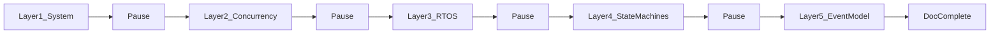
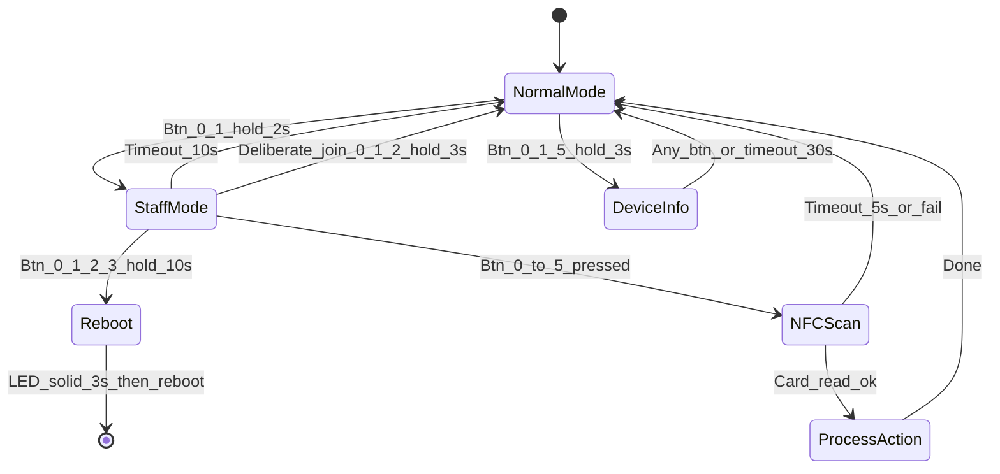
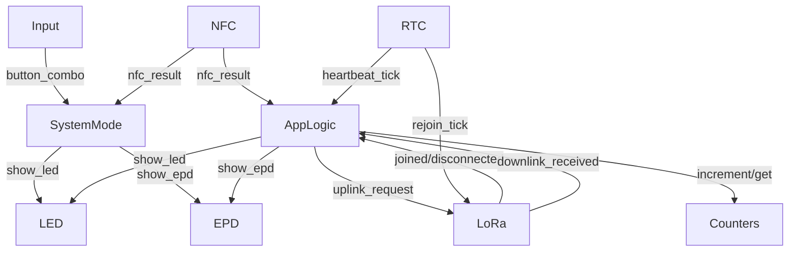

# FlexBox v1.2 — Zephyr Architecture (Living Document)

**Revision:** [Rev 1 - 2026-02-08]  
**FRD:** [fb-now-v1.2.md](../appnotes/fb-now-v1.2.md)  
**Target:** nRF52840, Zephyr RTOS — 6 buttons, NFC (PN5180), LoRa (SX1262), optional EPD, RTC, EEPROM, 1 LED, battery.

---

## Document Conventions

| Convention | Meaning |
|------------|--------|
| **Revisions** | Mark with `[Rev N - date]` or "Superseded by ..." so old ideas stay visible but clearly deprecated. |
| **No deletion** | Do not delete superseded content; strike-through or move to "Previous / deprecated" subsection. |
| **Reasoning** | Each major decision gets a short "Why" or "Trade-off" bullet. |
| **Open questions** | Collected in a dedicated subsection; resolved items moved to "Decisions" with rationale. |
| **Diagrams** | Mermaid only (no spaces in node IDs; double-quote labels with special chars). |

---

## Session Workflow

After each layer: confirm or refine; then update this doc and proceed.

---

## Layer 1: System-Level Architecture

### Subsystems / Components

| Subsystem | Responsibility | Owns / Drives |
|-----------|----------------|---------------|
| **Input** | Button scanning (0–5), combo detection (0+1, 0+1+2, 0+1+5, 0+1+2+3), hold timers, debounce | Raw button state; combo events (e.g. staff_mode_request, device_info_request) |
| **System mode** | Normal / Staff / NFC Scan / Device Info / Reboot path; timeouts (10s staff, 5s NFC, 30s device info) | Current system mode; mode transition logic |
| **NFC** | PN5180 control, ISO15693 read, 4-byte User ID; only active when mode = NFC Scan | NFC session state; success/failure/timeout result |
| **LoRa / network** | SX1262, LoRaWAN Class A, OTAA, join/rejoin, uplink scheduling, downlink handling | Network state (joined/disconnected); uplink queue when connected; downlink command handling |
| **Application logic** | Map (mode + button + NFC) to actions: public vote, check-in, check-out, registered vote; enforce public 5s lockout; trigger uplink payload build | Action requests; no persistent event queue when disconnected (counters only per FRD) |
| **Counters & storage** | 6× 24-bit button counters, EEPROM read/write, CRC, DevNonce, network and first-join flags | Counter values; persistence policy (e.g. write on each button press) |
| **RTC / time** | External RTC, timestamps for uplinks and EPD; DeviceTimeReq on join; daily heartbeat jitter (DevEUI-based) | Current time; alarm for wake from deep sleep |
| **LED** | Single LED; patterns: off, solid, 1 Hz blink, 3 fast blinks, etc., per FRD table | LED state machine (pattern + duration) |
| **EPD** (Variant A) | E-paper states: default "Last Cleaned", thanks, cleaning, device info, connecting; 5s/30s/45min timers; downlink update after thanks+5s | Display content state; refresh triggers |
| **Power** | Battery ADC, low-battery threshold → Event 0x05; deep sleep (GPIO + RTC wake), light sleep during NFC timeout | Power state; sleep policy |

### State Ownership (High-Level)

- **System mode**: owned by one place (system mode / state manager) so timeouts and transitions are deterministic.
- **Network state**: owned by LoRa/network subsystem; others observe (e.g. for counter-sync on rejoin).
- **Counters**: owned by counters & storage; application logic requests increment and persist; no other subsystem mutates counters.
- **LED/EPD**: each owns its own output state; they are consumers of "what to show" (driven by mode and application events).

### Interfaces (Conceptual, No Code)

- **Input → System mode**: "Button combo detected" (event or call); system mode applies timeouts and transitions.
- **System mode → NFC**: "Start NFC scan" / "Cancel NFC scan"; NFC → System mode: "NFC result" (success + User ID, timeout, error).
- **Application logic ↔ LoRa**: "Request uplink" (event type + payload); LoRa reports "joined" / "disconnected" / "downlink received".
- **Application logic ↔ Counters**: "Increment(button_id)"; "Get counter(button_id)" for payloads.
- **Application logic → LED / EPD**: "Show pattern X" / "Show screen Y"; LED/EPD handle timing locally.
- **RTC**: "Get timestamp"; "Set alarm for heartbeat / rejoin"; "Wake from sleep".
- **Power**: "Enter deep sleep" / "Enter light sleep"; battery sample on heartbeat.

### Trade-offs and Pitfalls (Layer 1)

- **Single owner for system mode**: Avoids two threads both trying to transition (timeout vs button) and race conditions; timeouts and button combos must be evaluated in one logical place or serialized.
- **No event queue when disconnected**: FRD says only counters in EEPROM when disconnected; counter-sync (0x07) on rejoin reconciles. Application logic does not maintain a persistent uplink queue in disconnected mode.
- **EPD and LED timing**: Long EPD updates (e.g. 5s thanks) and LED patterns must not block button or NFC handling; EPD/LED subsystems own internal timers.
- **Variant A vs B**: One codebase with `CONFIG_EPD_ENABLED`; EPD subsystem is optional; downlink EPD commands no-op in Variant B.

### Resolved Questions (Decisions)

- **"Queue Flush" on reconnect (FRD 4.9):** Upon joining, the device sends events for each button that has counters to uplink (Counter Sync, Event 0x07). So "Queue Flush" = run counter-sync uplinks per button, not a literal queued-event flush. *Why:* No full event queue is stored when disconnected; only counters persist; backend reconciles from last known count vs post-rejoin count.
- **First boot vs has_joined_once:** Deliberate join (Staff + 0+1+2) before any auto-join. Once the device has joined successfully, we store a flag in EEPROM (`has_joined_once`) so that subsequent boots can perform automatic join retries (10 attempts on boot, then hourly). System-mode and network subsystems both rely on this flag from storage.

---

## Layer 2: Concurrency Model

### What Runs Concurrently

| Execution context | Role | Blocking / non-blocking |
|-------------------|------|--------------------------|
| **Main / system-mode thread** | Owns system mode FSM; evaluates button combos and timeouts; drives mode transitions and coordinates NFC start/cancel | Can block on short waits (e.g. debounce); must not block on long I/O (NFC, EEPROM) if done in same thread — delegate or use work. |
| **Button / input** | Scan GPIO, detect combos and hold durations | Typically timer-driven or thread with short sleep; debounce is short; combo timers (2s, 3s, 10s) need a single place to avoid races. |
| **LoRa stack** | MAC/PHY, join, send, receive; Class A RX windows | Blocking on radio is acceptable in a dedicated thread or in LoRa driver callbacks; application must not assume immediate send. |
| **NFC** | PN5180 poll/read when in NFC Scan mode | Blocking with timeout (e.g. 5s) is acceptable in NFC thread or work queue; must be cancellable when mode exits. |
| **LED** | Run pattern (solid, blink, N blinks) | Non-blocking from app perspective: LED owns a timer/thread that advances pattern; "set pattern" is a request. |
| **EPD** | Update display; run 5s/30s/45min timers | EPD refresh can block (slow); run in work queue or low-priority thread so main loop and buttons remain responsive. |
| **RTC / alarms** | Heartbeat jitter, rejoin interval, wake from sleep | Timer callbacks or alarm IRQ; minimal work in ISR; schedule work for heartbeat/rejoin logic. |
| **Power / sleep** | Deep sleep (GPIO + RTC wake), light sleep during NFC timeout | Decided by main/supervisor; only one "sleep decision" owner. |

### Event-Driven vs Polling

- **Event-driven:** Button combo detected → system mode; NFC result → system mode; join success / disconnect → application + counter-sync; downlink received → command handler; RTC alarm → heartbeat or rejoin.
- **Polling (minimal):** Button GPIO can be polled in a loop with debounce, or via GPIO callback + timers for hold detection; prefer events from Input to System mode rather than System mode polling raw GPIO.

### Blocking Considerations

- **EEPROM write** on each button press: Keep write short; consider small delay or work queue so one slow write does not stall button response (or accept brief block if write is fast enough).
- **NFC read**: Up to 5s timeout; run in dedicated thread or work queue so system mode can still react to timeouts/cancel.
- **LoRa send**: Class A uplink blocks until TX and RX windows complete; LoRa thread or async API so application does not block.
- **EPD update**: Slow (seconds); always offloaded so UI and buttons stay responsive.

### Trade-offs (Layer 2)

- **Single thread for system mode + input:** Simplifies ownership of combo and timeout state; risk is one long operation blocking mode transitions — hence delegate NFC, EEPROM, EPD to other contexts.
- **LoRa in its own thread:** Matches common Zephyr LoRa app pattern; allows blocking on radio while rest of system runs.

---

## Layer 3: RTOS Primitive Mapping

### Suggested Mapping (Zephyr)

| Subsystem / concern | Primitive | Rationale |
|---------------------|-----------|-----------|
| **System mode FSM** | SMF (State Machine Framework) or explicit switch/table | SMF gives clear states and transitions; fits Normal/Staff/NFCScan/DeviceInfo/Reboot. Single SMF instance owned by one thread. |
| **Events between subsystems** | zbus (or k_msgq / k_poll) | zbus: pub/sub, decouples producers (input, NFC, LoRa, RTC) from consumers (system mode, app logic, LED, EPD). Alternative: message queues if you prefer explicit readers. |
| **Button scanning + combo** | Thread + k_timer for hold detection, or work queue triggered by GPIO callback | Thread allows periodic scan and combo state machine; timers for 2s/3s/10s holds. |
| **LoRa** | Dedicated thread (or LoRa stack thread) | Stack often has its own thread; app thread submits uplink requests via zbus or queue. |
| **NFC** | Work queue (k_work) or dedicated thread | When system mode enters NFC Scan, submit work to run PN5180 read with timeout; work can be cancelled on mode exit. |
| **LED** | Thread or k_timer in low-priority thread | Timer-driven state machine for pattern (on/off/blink count); "set pattern" via zbus or API. |
| **EPD** | Work queue | "Show screen X" enqueues work; work runs to completion (blocking EPD is OK here). |
| **Heartbeat / rejoin** | k_timer or RTC alarm | Timer callback posts event (e.g. zbus) to trigger heartbeat or rejoin logic in app/main thread. |
| **Counters & storage** | Service called from app logic (same or other thread); mutex if shared | EEPROM access serialized; increment + persist can be synchronous API. |

### Why These Choices

- **SMF for system mode:** Clear state names and transitions; easy to map to FRD table; one place for timeouts (entry timers or SMF + timer).
- **zbus for events:** Reduces coupling; Input, NFC, LoRa, RTC publish; system mode and application logic subscribe. Optional: use only where it adds value (e.g. mode transitions, uplink requests, downlink received).
- **Work for NFC and EPD:** Keeps long or blocking work off the main FSM thread; work can be cancelled (NFC) or serialized (EPD).
- **Dedicated LoRa thread:** Aligns with Zephyr LoRa sample design; radio and MAC block in that thread.

### Open / Alternative

- If zbus is not used: k_msgq or k_poll for a few channel types (combo, nfc_result, uplink_request, downlink_received, rtc_alarm) achieve similar decoupling with explicit queues.

---

## Layer 4: State Machines

### System Mode FSM (FRD-Aligned)

- **Normal:** Public taps (0–5) → vote + lockout 5s; no staff combo active.
- **Staff:** LED solid; 10s timeout or combo (join/reboot) or single button → NFC Scan.
- **NFC Scan:** LED 1 Hz blink; 5s timeout or fail → Normal; success → ProcessAction then Normal.
- **Device Info:** EPD (Variant A) or status uplink; 30s or any button → Normal.
- **Reboot:** LED solid 3s then reboot.
- **ProcessAction:** Check-in / check-out / registered vote; then transition to Normal.

### Timeouts — Who Triggers

| Timeout | Value | Owner | Mechanism |
|---------|--------|--------|-----------|
| Staff mode | 10s | System mode FSM | k_timer started on entry to Staff; on expiry post event or call FSM "timeout"; FSM transitions to Normal. |
| NFC scan | 5s | System mode or NFC | NFC work with 5s timeout; on timeout NFC posts "nfc_timeout"; FSM transitions to Normal. |
| Device info | 30s | System mode FSM | k_timer on entry to DeviceInfo; on expiry transition to Normal. |
| Public lockout | 5s | Application logic | Last-vote timestamp; reject press if &lt; 5s. |
| EPD "Thanks" | 5s | EPD subsystem | Internal timer; after 5s EPD returns to "Last Cleaned". |
| Cleaning auto-revert | 45min | EPD (Variant A) | Timer on check-in; on expiry set "Last Cleaned" with current RTC. |

### Optional Sub–State Machines

- **Network state:** Disconnected → Joining → Joined; used by LoRa subsystem; application observes for counter-sync on Joined.
- **LED pattern:** Idle / Solid / Blink_1Hz / N_fast_blinks; LED subsystem; entry/exit driven by events from system mode and application logic.
- **EPD screen:** Default / Thanks / Cleaning / DeviceInfo / Connecting; EPD subsystem; transitions on application and downlink events plus internal timers.

---

## Layer 5: Event Model

### Event Types (Conceptual)

| Event | Publisher | Subscribers | Notes |
|-------|-----------|-------------|--------|
| **button_combo** | Input | System mode | Payload: combo id (staff_request, device_info, deliberate_join, reboot, single_button_0..5). |
| **nfc_result** | NFC | System mode, Application logic | Success (User ID) / timeout / error. |
| **uplink_request** | Application logic | LoRa | Event type (0x00–0x07) + payload; LoRa enqueues or sends when connected. |
| **joined** / **disconnected** | LoRa | Application logic, System mode (if needed) | On joined: trigger counter-sync (Event 0x07 per button). |
| **downlink_received** | LoRa | Application logic (command dispatcher) | Payload: command code + data; dispatch to EPD update, refresh, status request, reset counters. |
| **heartbeat_tick** | RTC / timer | Application logic | Trigger heartbeat uplink (0x04), battery sample, RTC sync. |
| **rejoin_tick** | RTC / timer | LoRa | When disconnected; trigger join attempt (rate-limited). |
| **show_led** | System mode, Application logic | LED | Pattern id + optional duration. |
| **show_epd** | Application logic, Command handler | EPD | Screen id + optional data (timestamp, device info). |

### Sync vs Async

- **Async (post and return):** button_combo, nfc_result, uplink_request, downlink_received, show_led, show_epd — producers do not wait for consumer completion.
- **Sync (optional):** Increment counter + persist could be synchronous call from application logic to Counters & storage so that "next uplink" sees updated value; acceptable if EEPROM write is fast enough.

### zbus as Inspiration

- Channels: e.g. `button_combo`, `nfc_result`, `uplink_request`, `network_status`, `downlink`, `led_cmd`, `epd_cmd`, `heartbeat_tick`, `rejoin_tick`.
- Subscribers: system mode (button_combo, nfc_result); application logic (nfc_result, network_status, downlink); LoRa (uplink_request); LED (led_cmd); EPD (epd_cmd); heartbeat/rejoin from timer to app/LoRa.
- If not using zbus: same events can be implemented with k_msgq or k_poll for each channel type.

### Summary Diagram

---

## Document History

| Rev | Date | Changes |
|-----|------|--------|
| 1 | 2026-02-08 | Initial architecture: Layers 1–5 (system, concurrency, RTOS primitives, state machines, event model). Resolved: Queue Flush = counter-sync on join; has_joined_once in EEPROM for subsequent retries. |
